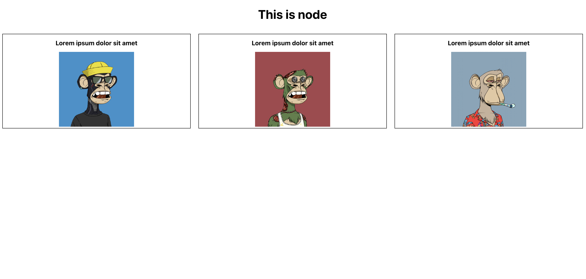
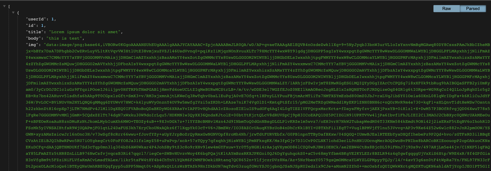

# Fullstack-playground

# client Tree

```
📦client
 ┣ 📂public
 ┃ ┣ 📜favicon.ico
 ┃ ┣ 📜index.html
 ┃ ┣ 📜logo192.png
 ┃ ┣ 📜logo512.png
 ┃ ┣ 📜manifest.json
 ┃ ┗ 📜robots.txt
 ┣ 📂src
 ┃ ┣ 📂components
 ┃ ┃ ┗ 📜Test.js
 ┃ ┣ 📜App.css
 ┃ ┣ 📜App.js
 ┃ ┣ 📜App.test.js
 ┃ ┣ 📜index.css
 ┃ ┣ 📜index.js
 ┃ ┣ 📜logo.svg
 ┃ ┣ 📜reportWebVitals.js
 ┃ ┗ 📜setupTests.js
 ┣ 📜.gitignore
 ┣ 📜README.md
 ┣ 📜package-lock.json
 ┗ 📜package.json
```

&nbsp;
&nbsp;

# Server Tree

```
📦server
┣ 📂src
┃ ┣ 📂Data
┃ ┃ ┣ 📜data.js
┃ ┃ ┣ 📜test1.png
┃ ┃ ┗ 📜test2.png
┃ ┣ 📂pages
┃ ┃ ┗ 📜todo.js
┃ ┗ 📜hello.js
┣ 📜.babelrc
┣ 📜index.js
┣ 📜now.json
┣ 📜package.json
┗ 📜vercel.json
```

&nbsp;
&nbsp;

## FullStack Playground built and maintained by [Milan Sachani &#x1F49C;](https://milansachani.dev)
